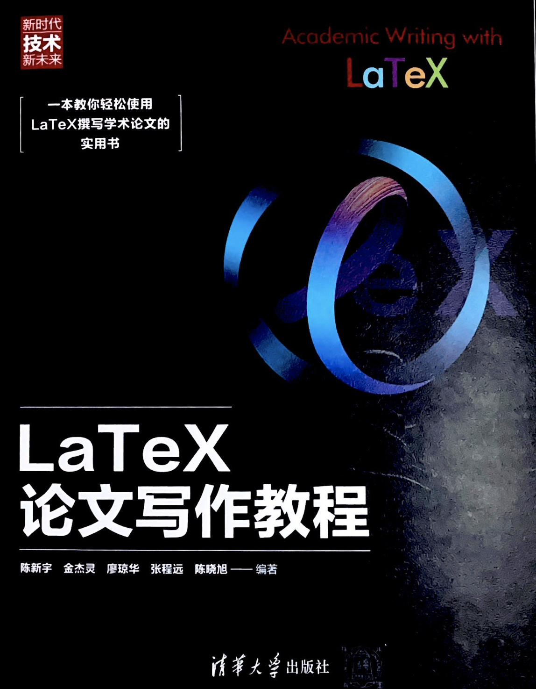

# LaTeX论文写作教程 (中文版)

### 出版信息

> 陈新宇，金杰灵，廖琼华，张程远，陈晓旭. **LaTeX论文写作教程** (Academic Writing with LaTeX). 清华大学出版社，2023.

 

 

**纸质书购买**：[清华大学出版社京东自营官方旗舰店](https://item.jd.com/14204878.html)

 

## 章节内容（第一版）

- 写在前面
  - [x] [内容简介](https://nbviewer.org/github/xinychen/latex-cookbook/blob/main/version-1/chapter-0/intro.ipynb)
  - [x] [前言](https://nbviewer.org/github/xinychen/latex-cookbook/blob/main/version-1/chapter-0/preface.ipynb)
- 第一章 LaTeX的出现与发展
  - [x] [1.0 导言](https://nbviewer.jupyter.org/github/xinychen/latex-cookbook/blob/main/version-1/chapter-1/section0.ipynb)
  - [x] [1.1 横空出世的TeX](https://nbviewer.jupyter.org/github/xinychen/latex-cookbook/blob/main/version-1/chapter-1/section1.ipynb)
  - [x] [1.2 引领浪潮的LaTeX](https://nbviewer.jupyter.org/github/xinychen/latex-cookbook/blob/main/version-1/chapter-1/section2.ipynb)
  - [x] [1.3 应运而生的在线系统](https://nbviewer.jupyter.org/github/xinychen/latex-cookbook/blob/main/version-1/chapter-1/section3.ipynb)
  - [x] [1.4 LaTeX问答社区](https://nbviewer.jupyter.org/github/xinychen/latex-cookbook/blob/main/version-1/chapter-1/section4.ipynb)
  - [x] [1.5 关于LaTeX的开源项目](https://nbviewer.jupyter.org/github/xinychen/latex-cookbook/blob/main/version-1/chapter-1/section5.ipynb)
- 第二章 LaTeX基础及文档类型
  - [x] [2.0 导言](https://nbviewer.jupyter.org/github/xinychen/latex-cookbook/blob/main/version-1/chapter-2/section0.ipynb)
  - [x] [2.1 LaTeX语法规则](https://nbviewer.jupyter.org/github/xinychen/latex-cookbook/blob/main/version-1/chapter-2/section1.ipynb)
  - [x] [2.2 LaTeX代码结构](https://nbviewer.jupyter.org/github/xinychen/latex-cookbook/blob/main/version-1/chapter-2/section2.ipynb)
  - [x] [2.3 文档类型的介绍](https://nbviewer.jupyter.org/github/xinychen/latex-cookbook/blob/main/version-1/chapter-2/section3.ipynb)
  - [x] [2.4 全局格式设置](https://nbviewer.jupyter.org/github/xinychen/latex-cookbook/blob/main/version-1/chapter-2/section4.ipynb)
  - [x] [2.5 简单文档的制作](https://nbviewer.jupyter.org/github/xinychen/latex-cookbook/blob/main/version-1/chapter-2/section5.ipynb)
  - [x] [2.6 中文文档的制作](https://nbviewer.jupyter.org/github/xinychen/latex-cookbook/blob/main/version-1/chapter-2/section6.ipynb)
- 第三章 文本编辑
  - [x] 3.0 导言
  - [x] 3.1 创建标题部分、摘要及关键词
  - [x] 3.2 创建章节
  - [x] 3.3 生成目录
  - [x] 3.4 编辑段落
  - [x] 3.5 编辑文本
  - [x] 3.6 创建列表
  - [x] 3.7 创建页眉、页脚及脚注
- 第四章 公式编辑
  - [x] 4.0 导言
  - [x] 4.1 基本介绍
  - [x] 4.2 常用数学符号
  - [x] 4.3 希腊字母
  - [x] 4.4 微积分
  - [x] 4.5 线性代数
  - [x] 4.6 概率论与数理统计
  - [x] 4.7 优化理论
- 第五章 表格制作
  - [x] 5.0 导言
  - [x] 5.1 基本介绍
  - [x] 5.2 调整表格内容
  - [x] 5.3 调整表格样式
- 第六章 图形插入
  - [x] 6.0 导言
  - [x] 6.1 插入浮动图片
  - [x] 6.2 插入非浮动图片
  - [x] 6.3 插入图表目录
  - [x] 6.4 定制图表标题样式
  - [x] 6.5 插入子图
- 第七章 图形绘制
  - [x] 7.0 导言
  - [x] 7.1 基本介绍
  - [x] 7.2 节点介绍
  - [x] 7.3 高级功能
  - [x] 7.4 复杂模型实例解析
- 第八章 建立索引及文献引用
  - [x] 8.0 导言
  - [x] 8.1 图表与公式的索引
  - [x] 8.2 创建超链接
  - [x] 8.3 BibTex用法
  - [x] 8.4 文献引用格式
- 第九章 幻灯片制作
  - [x] 9.0 导言
  - [x] 9.1 基本介绍
  - [x] 9.2 添加动画效果
  - [x] 9.3 创建文本框
  - [x] 9.4 设置主题样式
  - [x] 9.5 插入程序源代码
  - [x] 9.6 添加参考文献
  - [x] 9.7 插入表格
  - [x] 9.8 插入与调整图片
- 第十章 LaTeX进阶
  - [x] 10.0 导言
  - [x] 10.1 添加程序源代码
  - [x] 10.2 添加算法伪代码
  - [x] 10.3 制作海报
  - [x] 10.4 制作简历
  - [x] 10.5 制作报告

 

> [如GitHub打开方式不佳，请打开此链接使用nbviewer浏览章节内容目录。](https://nbviewer.org/github/xinychen/latex-cookbook/blob/main/version-1/chapter-0/tableofcontents.ipynb)

 

## 章节内容（最新版）

- 写在前面

 

## 支持我们

如果你喜欢本教程，欢迎在评论区（[create a new issue!](https://github.com/xinychen/latex-cookbook/issues)）给出你宝贵的意见！一同完善本教程，为大家提供更好的学习资源。
